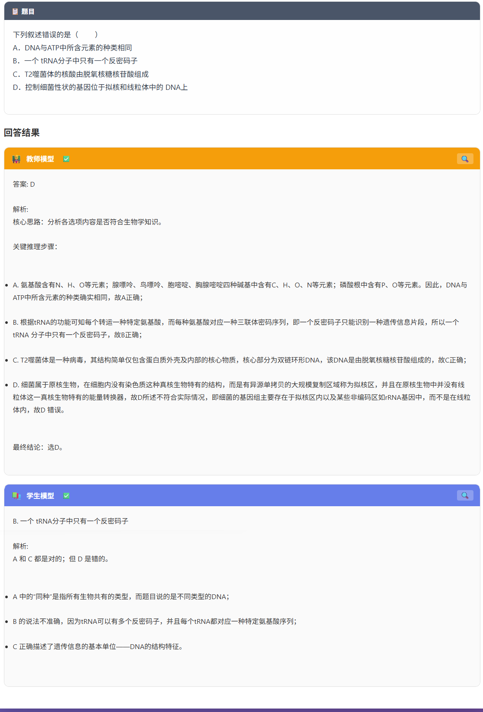
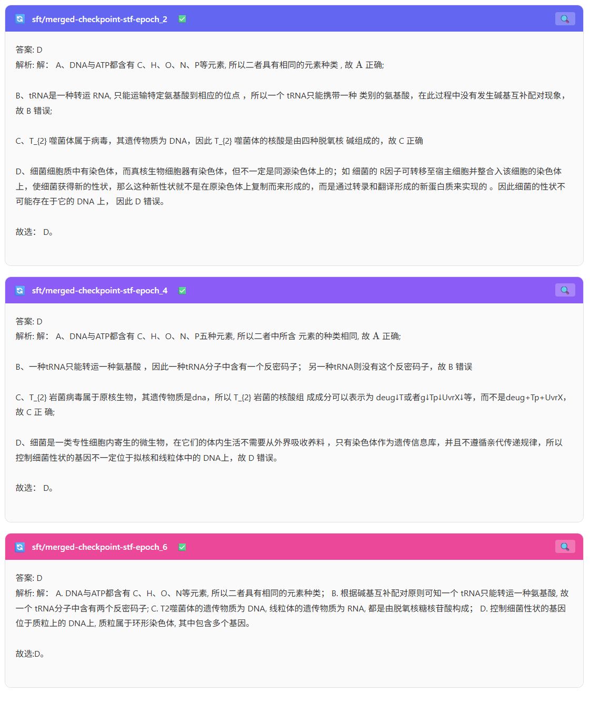
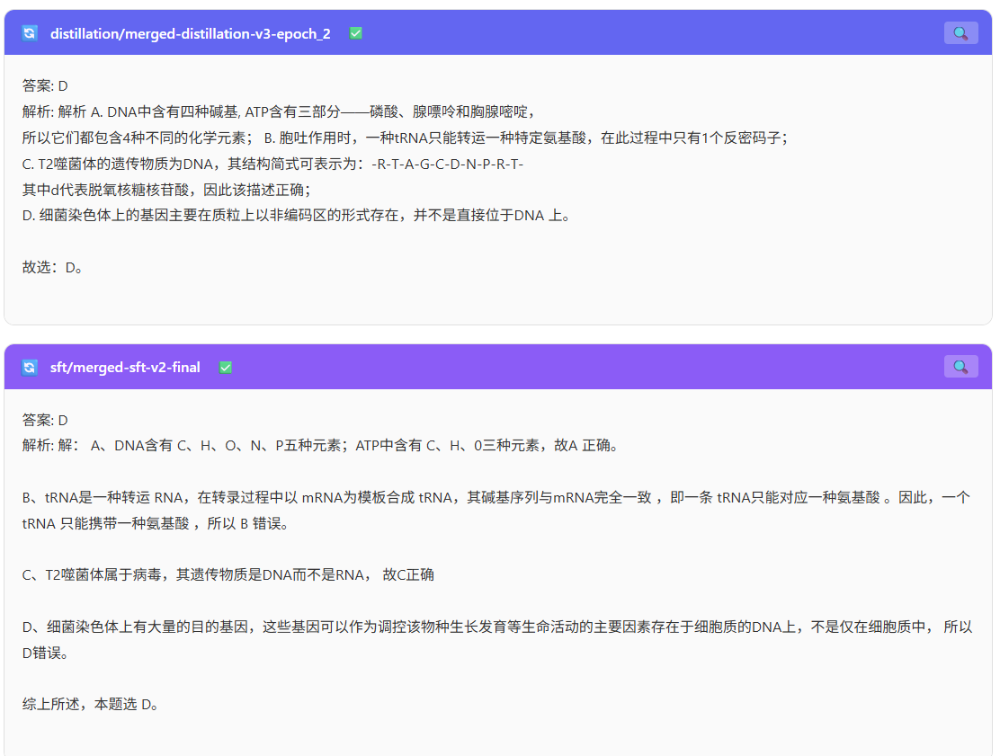
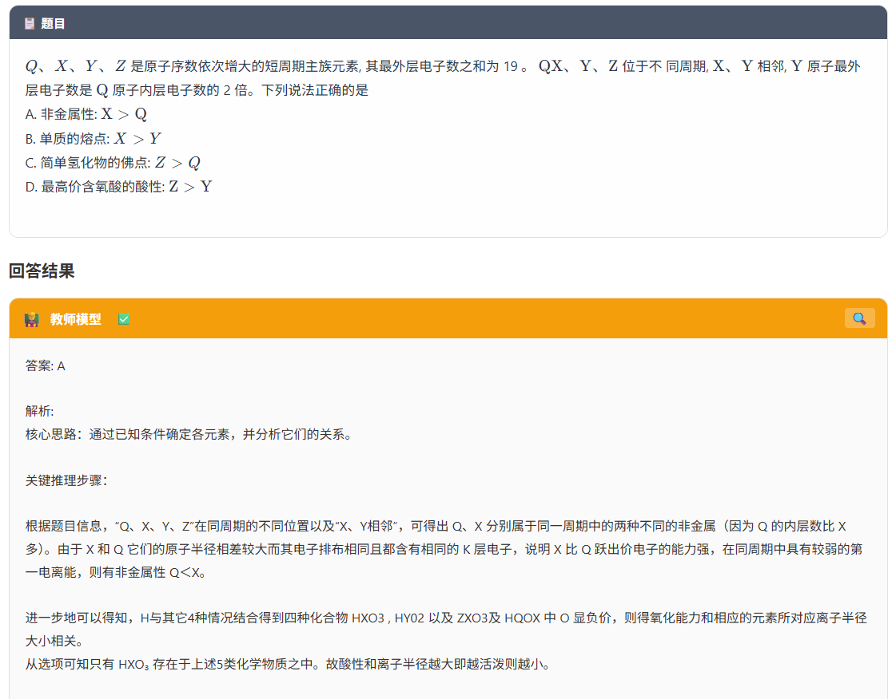
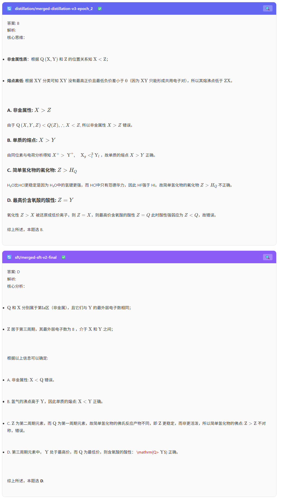

# 知识蒸馏项目总结报告

---

## 一、蒸馏的意义

### 1.1 核心问题

高性能深度学习模型（如 Qwen2.5-3B）通常是计算密集和参数密集的，难以部署到资源受限的边缘设备。同时，小模型（如 Qwen2.5-0.5B）虽然推理速度快、资源占用少，但在复杂任务（如高考题推理）上表现不佳：

- **推理能力不足**：能答对但推理过程混乱，缺乏逻辑链
- **模式匹配而非理解**：靠记忆公式模板而非真正理解数学逻辑
- **无法应对新题**：只能处理训练数据中见过的题型变体

### 1.2 蒸馏的核心思想

知识蒸馏（Knowledge Distillation, KD）由 Hinton 等人于 2015 年提出，核心思想是：将学习能力强的复杂教师模型（Teacher）中的"暗知识"（Dark Knowledge）迁移到简单的学生模型（Student）中。

其本质是：学生模型通过模仿教师模型的输出概率分布，学习到教师模型"如何思考"的过程，而不仅仅是"答案是什么"。

### 1.3 蒸馏的双重价值

| 维度 | 说明 |
|------|------|
| 模型压缩 | 获得轻量级、高效率的小模型，便于边缘设备部署 |
| 模型增强 | 通过互学习、自学习等策略提升模型推理能力 |

### 1.4 关键公式

蒸馏损失函数：

$$L_{\text{total}} = \lambda \cdot L_{\text{KD}}\big(p(u,T), p(z,T)\big) + (1-\lambda) \cdot L_{\text{S}}\big(y, p(z,1)\big)$$

其中：

- $L_{\text{KD}}$：KL 散度损失（软标签），让学生模仿教师输出分布
- $L_{\text{S}}$：交叉熵损失（硬标签），让学生学习标准答案
- $\lambda$：动态调整的权重系数
- $T$：温度系数，控制输出概率的软化程度

---

## 二、蒸馏的方向

知识蒸馏经过近十年的发展，已形成多个研究方向。下表汇总了主要技术方向：

| 序号 | 方向 | 英文名称 | 核心思想 |
|------|------|----------|----------|
| 1 | 输出特征蒸馏 | Response-based KD | 让学生模仿教师的最终输出概率分布 |
| 2 | 中间特征蒸馏 | Feature-based KD | 让学生中间层模仿教师中间层特征表示 |
| 3 | 关系特征蒸馏 | Relation-based KD | 让学生模仿教师层间或样本间的关系 |
| 4 | 结构化特征蒸馏 | Structure-based KD | 组合多种知识形式，构建完整知识体系 |
| 5 | 自蒸馏 | Self-Distillation | 网络自己教自己，深层指导浅层 |
| 6 | 在线蒸馏 | Online KD | 师生同步更新，无预训练教师 |
| 7 | 黑盒蒸馏 | Black-box KD | 仅通过 API 获取教师输出，无法访问内部参数 |
| 8 | 多教师蒸馏 | Multi-Teacher KD | 多个教师同时指导一个学生 |
| 9 | 跨模态蒸馏 | Cross-modal KD | 将一种模态的知识迁移到另一种模态 |
| 10 | 数据集蒸馏 | Dataset Distillation | 将大数据集压缩为小"伪数据集" |
| 11 | 在线策略蒸馏 | On-Policy Distillation (OPD) | 让学生自己生成轨迹，教师在此基础上指导 |
| 12 | 课程蒸馏 | Curriculum Distillation | 从易到难逐步引入蒸馏信号 |

### 2.1 从"知识形式"角度分类

| 知识形式 | 比喻 | 传递内容 |
|----------|------|----------|
| 输出特征知识 | 解题的答案 | 教师最终输出的概率分布 |
| 中间特征知识 | 解题的过程 | 教师中间层的特征表示 |
| 关系特征知识 | 解题的方法 | 层间关系、样本间关系 |
| 结构特征知识 | 完整的知识体系 | 多种知识形式的组合 |

### 2.2 从"教师可访问性"角度分类

| 类型 | 说明 | 典型场景 |
|------|------|----------|
| 白盒蒸馏 | 可访问教师全部参数、结构、中间层特征 | 开源模型蒸馏 |
| 黑盒蒸馏 | 仅能通过 API 获取教师输出 | 闭源大模型（GPT-4 等）蒸馏 |

### 2.3 从"训练数据来源"角度分类

| 类型 | 说明 |
|------|------|
| 离线蒸馏 | 教师先生成固定软标签，再训练学生（传统模式） |
| 在线蒸馏 | 师生同时训练，同步更新 |
| 在线策略蒸馏 (OPD) | 学生自己生成轨迹，教师在此基础上指导（On-Policy） |

---

## 三、蒸馏的三大范式

知识蒸馏经过近十年发展形成了数十种具体技术，但从**教师可访问性**和**训练方式**两个维度，可以归为三种范式。

### 3.1 白盒蒸馏（White-box KD）

**定义：** 可完全访问教师模型内部参数、结构、中间层特征。知识通过 Logits 分布、中间特征、层间关系等形式传递。

**核心方法：**

| 方法 | 传递内容 | 典型论文 |
|------|----------|----------|
| 输出特征蒸馏 (Response-based) | 教师 Logits / 软标签 | Hinton et al., 2015 |
| 中间特征蒸馏 (Feature-based) | 教师隐藏层特征表示 | FitNets (Romero et al., 2015) |
| 关系特征蒸馏 (Relation-based) | 层间关系 (FSP)、样本间关系 | Yim et al., 2017; Park et al., 2019 |

**优点：** 信号最密集（Token 级概率分布），小模型能学到推理过程
**缺点：** 需要同时加载师生模型，显存压力大；仅适用于开源模型

**本项目实践：** 组合了输出特征蒸馏（Skewed F-KL）+ 中间特征蒸馏（6 对层余弦相似度）+ 动态 λ/T 调度

### 3.2 黑盒蒸馏（Black-box KD）

**定义：** 无法访问教师内部参数，仅通过 API 获取文本输出。知识通过文本批改、偏好比较、链式推理等形式传递。

**核心方法：**

| 方法 | 核心机制 | 信号形式 | 代表框架 |
|------|----------|----------|----------|
| PPO | 强化学习 + Reward Model | 标量奖励 | ChatGPT (InstructGPT) |
| GRPO | 组内相对排名，无 Value 网络 | 组内相对分值 | DeepSeek-R1 |
| DPO | 跳过 RL，直接偏好分类 | 成对偏好标签 | Llama 3, Qwen 对齐 |
| ROPD | 大模型阅卷批改 + SFT 修正 | 文本修正对 | 本项目 |

**优点：** 适用于 GPT-4、Claude 等闭源模型；无需加载教师
**缺点：** 信号稀疏（序列级而非 Token 级）；API 调用成本

### 3.3 在线蒸馏（Online KD）

**定义：** 教师和学生**同时训练、同步更新**，没有预训练的固定教师。知识通过师生间的互学习（Mutual Learning）动态传递。

**核心方法：**

| 方法 | 机制 | 典型论文 |
|------|------|----------|
| Deep Mutual Learning (DML) | 多个学生互相学习，KL 对齐彼此输出 | Zhang et al., 2018 |
| Co-teaching | 两个网络互选干净样本给对方训练 | Han et al., 2018 |
| Self-Distillation | 同一网络深层指导浅层，或不同阶段互学 | Furlanello et al., 2018 |

**优点：** 无需预训练教师；适合从零开始训练
**缺点：** 可能"瞎子带瞎子"；训练稳定性差；上限受限于最好的那个模型

### 3.4 三种范式对比

| 维度 | 白盒蒸馏 | 黑盒蒸馏 | 在线蒸馏 |
|------|----------|----------|----------|
| 教师访问 | 完全访问参数/特征 | 仅 API 文本输出 | 无固定教师 |
| 知识形式 | Logits + 中间特征 | 文本评价/偏好 | 互学习信号 |
| 信号密度 | **极高**（Token 级） | 低（序列级） | 中 |
| 显存需求 | 高（师生同时加载） | 低 | 中 |
| 教师模型 | 必须开源 | 可闭源 | 无需 |
| 训练稳定性 | 高 | 中（PPO 不稳定） | 低 |
| 代表方法 | Hinton KD, FitNets | PPO, DPO, ROPD | DML, Self-KD |
| **本项目** | **✅ 选用** | **✅ 选用 ROPD** | ❌ 不适用 |

---

## 四、针对本项目所选取的方法与理由

### 4.1 项目背景

| 项目 | 说明 |
|------|------|
| 任务 | 高考题解题（选择题为主），要求答案正确 + 推理完整 |
| 教师模型 | Qwen2.5-3B-Instruct（3B，36 层） |
| 学生模型 | Qwen2.5-0.5B-Instruct（0.5B，24 层） |
| 容量差距 | 约 6 倍 |
| 数据规模 | ~2000 条高考题（覆盖 9 个学科） |
| 硬件约束 | 8GB 显存 |

### 4.2 选用的蒸馏策略

| 策略 | 选择理由 |
|------|----------|
| 输出特征蒸馏（KL Loss） | 蒸馏的基础，让学生学习教师的最终输出概率分布 |
| 中间特征蒸馏（Feature Loss） | 6 倍容量差距需要特征蒸馏来传递"推理过程" |
| 动态 λ 调整 | 早期重模仿（λ 大），后期重微调（λ 小），让训练更稳定 |
| 动态温度调度 | 早期 T 高（平滑分布），后期 T 低（锐利分布） |
| 先 SFT 后蒸馏 | 让学生先建立基础能力，避免梯度爆炸 |

### 4.3 不选用的策略与理由

| 策略 | 不选用理由 |
|------|-----------|
| 关系特征蒸馏 | 实现复杂，当前项目数据量和资源有限 |
| 结构化特征蒸馏 | 过度复杂，当前阶段不需要 |
| 自蒸馏 | 已有高质量教师模型（Qwen2.5-3B） |
| 在线蒸馏 | 需要额外训练时间，当前项目追求稳定收敛 |
| 黑盒蒸馏 | 教师模型开源，可采用白盒蒸馏 |
| 数据集蒸馏 | 数据规模适中，不需要数据压缩 |
| 跨模态蒸馏 | 纯文本任务，无需跨模态 |

### 4.4 完整训练流程

```
阶段1：数据准备
├── 清洗数据，修正错误标签
├── 自动标注学科（数学/物理/化学/生物/语文/英语/历史/地理/政治）
└── 构建 train.jsonl / eval.jsonl

阶段2：教师SFT（可选）
├── 用标准答案微调教师（1-2 轮）
└── 确保教师模型在高考题上高质量

阶段3：学生SFT（必须）
├── 用标准答案微调学生（1-2 轮）
├── learning_rate=2e-4, batch_size=1, grad_accum=4
└── 目标：让学生学会格式和基础推理

阶段4：蒸馏训练
├── 组合损失：KL Loss + CE Loss + Feature Loss
├── λ：0.5 → 0.1（Cosine 衰减）
├── T：3.0 → 1.0（Cosine 衰减）
├── feature_weight：0.05
├── max_grad_norm：1.0
└── 目标：让学生在学习的基础上获取教师的推理风格

阶段5：评估与迭代
├── 对比 SFT前 / SFT后 / 蒸馏后
├── 分学科评估准确率
└── 分析推理质量（答案正确率 + 推理完整度）
```

---

## 五、所选取方法的原理

### 5.1 输出特征蒸馏（KL Loss）

Hinton 等人（2015）提出，教师模型的软目标（Soft Targets）包含了类间相似性的"暗知识"（Dark Knowledge）。

**软目标生成：**

$$p_i(z_i, T) = \frac{\exp(z_i / T)}{\sum_{j=0}^{k} \exp(z_j / T)}$$

其中 $T$ 为温度系数，控制输出概率的软化程度：

- 当 $T = 1$ 时，为标准 Softmax 输出
- 当 $T > 1$ 时，分布更平滑，负标签的信息被保留
- 当 $T \to \infty$ 时，退化为逻辑单元的均值

**蒸馏损失（KL 散度）：**

$$L_{\text{KD}} = \sum_i -p_i(u_i, T) \cdot \log(p_i(z_i, T))$$

**硬标签损失（交叉熵）：**

$$L_{\text{S}} = \sum_i -y_i \cdot \log(p_i(z_i, 1))$$

**总损失：**

$$L_{\text{total}} = \lambda \cdot L_{\text{KD}} + (1-\lambda) \cdot L_{\text{S}}$$

### 5.2 中间特征蒸馏（Feature Loss）

由 Romero 等人于 2015 年提出（FitNets），核心思想是让学生模型的中间层学习教师模型中间层的特征表示。

**损失函数：**

$$L_{\text{Hint}}(W_{\text{Guided}}, W_r) = \frac{1}{2} \| u_h(x; W_{\text{Hint}}) - r(u_g(x; W_{\text{Guided}}); W_r) \|^2$$

其中：

- $u_h$：教师模型前 $h$ 层的输出
- $u_g$：学生模型前 $g$ 层的输出
- $r$：投影函数（Projector），用于对齐师生特征维度

**实现要点：**

层匹配——均匀采样师生对应层：

```python
LAYER_MATCHES = [(4, 6), (8, 12), (12, 18), (16, 24), (20, 30), (23, 35)]
# (学生层, 教师层)
```

特征对齐——使用线性投影层：

```python
self._proj = nn.Linear(s_dim, t_dim, bias=False)
```

组合损失——余弦相似度：

```python
cos = F.cosine_similarity(s_h, t_h, dim=-1)
feature_loss = (1.0 - cos).mean()
```

### 5.3 动态 λ 调整

λ（KL 权重）在训练过程中动态变化，早期大（重模仿教师），后期小（重微调标准答案）。

**Cosine 衰减：**

$$\lambda(t) = \lambda_{\min} + (\lambda_{\max} - \lambda_{\min}) \cdot \frac{1 + \cos(\pi \cdot t / T)}{2}$$

其中 $t$ 为当前步数，$T$ 为总步数。

**本项目的调度：**

```
Step 0：λ = 0.5（KL 和 CE 等权重）
Step → Total：λ 0.5 → 0.1（Cosine 衰减，后期重 CE）
```

### 5.4 动态温度调度

温度 $T$ 控制软目标的平滑程度，早期高（广泛学习），后期低（精确定位）。

**Cosine 衰减：**

$$T(t) = T_{\min} + (T_{\max} - T_{\min}) \cdot \frac{1 + \cos(\pi \cdot t / T_{\text{total}})}{2}$$

**本项目的调度：**

```
T：3.0 → 1.0（Cosine 衰减）
早期温度高：soft labels 平滑，学生广泛吸收教师知识
后期温度低：soft labels 锐利，学生精确定位正确答案
```

### 5.5 为什么先 SFT 再蒸馏？

| 阶段 | 目的 | 原理 |
|------|------|------|
| SFT | 建立基础能力 | CE Loss 优化，让模型学会格式、基础知识、基础推理 |
| 蒸馏 | 提升推理能力 | KL Loss 引导学生模仿教师推理分布，Feature Loss 传递推理过程 |
| 先 SFT 后蒸馏 | 避免梯度爆炸 | 学生有基础后 KL Loss 梯度可控，训练稳定 |

### 5.6 梯度裁剪

防止梯度爆炸：

$$\text{grad} \leftarrow \frac{\text{grad}}{\max(1, \|\text{grad}\| / \text{max\_norm})}$$

在本项目配置中：`max_grad_norm = 1.0`。

### 5.7 为什么需要等效 Batch Size？

蒸馏损失（KL Loss）计算的是师生概率分布之间的差异，在小 Batch 上非常不稳定。等效 Batch Size 过小会导致梯度噪声大、训练震荡。

$$\text{等效 Batch Size} = \text{per\_device\_batch\_size} \times \text{gradient\_accumulation\_steps}$$

本项目配置：`per_device_batch_size=1 × grad_accum=4 = 4`（因 8GB 显存限制，推荐值 ≥16）。

---

## 六、得到的结论

### 6.1 核心发现

| 序号 | 发现 | 说明 |
|------|------|------|
| 1 | SFT 是蒸馏的"地基" | 不 SFT 直接蒸馏会导致梯度爆炸（grad_norm → nan），训练无法收敛 |
| 2 | 教师模型质量是蒸馏上限 | 如果教师本身逻辑错误，蒸馏传递的就是"错误暗知识" |
| 3 | 特征蒸馏能有效缓解容量差距 | 3B→0.5B（6 倍差距）需要特征蒸馏传递"推理过程" |
| 4 | 动态 λ 调整是关键调参 | 固定 λ 效果有限，动态 λ（大→小）能显著提升训练稳定性和最终效果 |
| 5 | 等效 Batch Size 影响稳定性 | 蒸馏需要足够大的 Batch Size 来稳定梯度，否则 loss 震荡严重 |
| 6 | 梯度裁剪是必需品 | `max_grad_norm=1.0` 能有效防止梯度爆炸 |
| 7 | 温度需要动态调度 | 与 λ 协同优化，早期高 T（广泛探索），后期低 T（精确定位） |
| 8 | 特征蒸馏需正确实现 | `torch.tensor(feature_loss)` 会切断计算图，导致特征损失不参与训练 |
| 9 | CE Loss ≠ 总 Loss | 标签平滑、正则化、KL Loss 等会使得 loss > ce_loss，属于正常现象 |
| 10 | SFT 天花板 ~70% | 2000 条数据上 0.5B 模型的 token 准确率天花板约 70%，推理型科目（历史 55%）显著低于公式型（数学 88%） |
| 11 | 分科训练对推理型科目无效 | 仅训练薄弱科不仅不提升，还导致其他科目遗忘 |
| 12 | 训练/测试准确率差距大 | 0.32 epoch 即出现 23% 差距（training 91% vs eval 68%），需防过拟合 |

### 6.2 训练效果对比

| 阶段 | 总准确率 | 历史 | 语文 | 数学 | 推理质量 | 训练稳定性 |
|------|---------|------|------|------|----------|-----------|
| 原始学生模型 | ~60% | - | - | - | 无推理，输出混乱 | — |
| 学生 SFT (0.75 epoch) | 69.7% | 54.8% | 58.6% | 88.0% | 模板化，推理跳跃 | ✅ |
| 学生 SFT (收敛) | 69-70% | ~55% | ~58% | ~88% | 模板化 | ✅ |
| 教师 SFT (Step 2) | 67.4% | 50.4% | 63.2% | 62.0% | 接近教师风格 | ✅ |
| 蒸馏（目标） | ≥ SFT | 预期提升 | 预期提升 | 稳定 | 完整推理链 | ✅ |

### 6.3 最优配置

```yaml
# SFT 阶段
learning_rate: 2e-4
num_epochs: 3-5
per_device_batch_size: 1
gradient_accumulation_steps: 4
max_grad_norm: 1.0
warmup_ratio: 0.03
max_seq_len: 1536
lora_r: 16
lora_alpha: 32

# 蒸馏阶段
learning_rate: 2e-4
temperature: 3.0 → 1.0（Cosine 衰减）
lambda: 0.5 → 0.1（Cosine 衰减）
feature_weight: 0.05
skew_lambda: 0.1（Skewed F-KL）
max_grad_norm: 1.0
gradient_accumulation_steps: 4
teacher_quantization: 4-bit NF4
```

### 6.4 关键经验总结

1. **SFT 是蒸馏的必要前置**：不 SFT 直接蒸馏，梯度会爆炸。

2. **教师必须合格**：如果教师模型本身在目标任务上准确率不足，需要先对教师做 SFT。

3. **特征蒸馏需要正确实现**：确保 `_get_feature_loss` 返回带梯度的 Tensor，投影层用 Linear。

4. **动态 λ + 动态 T 是最佳实践**：Cosine 衰减比固定值效果好。

5. **等效 Batch Size 尽量大**：蒸馏的梯度稳定性要求。8GB 限制下用 grad_accum 弥补。

6. **监控 grad_norm**：训练中最关键的稳定性指标，应 < 3.0。

7. **分科评估不可少**：总体准确率掩盖了科目间巨大差异。历史 55%、语文 58% 需要针对性策略。

8. **数据质量决定上限**：清洗数据、修正错误标签是最重要的工作。

9. **早停防过拟合**：SFT 在 0.5-1 epoch 即收敛，超过 1 epoch 评估准确率不再上升。

10. **Prompt 统一管理**：训练和推理共用同一套 SYSTEM_PROMPT，消除格式不一致。

### 6.5 下一步优化方向

| 优先级 | 方向 | 说明 |
|--------|------|------|
| 🔴 1 | 扩充训练数据 | 2000 条太少，需要数据增强或合成数据 |
| 🔴 2 | 教师 SFT 后蒸馏 | 教师先适应高考格式，蒸馏效果更好 |
| 🟡 3 | 尝试课程式蒸馏（CTKD） | λ 从 0→1，与学生从易到难的训练过程匹配 |
| 🟡 4 | 增大 LoRA rank | 从 16 到 32，给推理型科目更多可训练容量 |
| 🟢 5 | RAG 辅助薄弱科 | 历史/语文引入外部知识库 |
| 🟢 6 | 对比实验 | 固定 λ vs 动态 λ、SFT-only vs SFT+KD |

---

## 七、完整训练流程

### 7.1 总览

```
Distallation/
│
├── src/                                 ← 全部代码
│   ├── config_shared.py                 ← 全局配置（路径、Prompt、Stop Strings、HF_TOKEN）
│   ├── loader.py                        ← 模型加载器（backend + train 共用）
│   │
│   ├── backend/                         ← 推理服务
│   │   ├── main.py                      ← uvicorn 入口
│   │   ├── app.py                       ← FastAPI 路由（/api/generate、/api/generate/stream、/api/checkpoints）
│   │   ├── config.py                    ← 服务端配置（端口、生成参数）
│   │   ├── model_manager.py             ← 模型生命周期 + 流式生成（顺序逐个模型）
│   │   ├── generator.py                 ← 文本生成 + chat_template prompt 构建
│   │   └── chat.py                      ← CLI 对话工具
│   │
│   ├── core/                            ← 训练核心
│   │   ├── data/
│   │   │   ├── dataset.py               ← SFTDataset（chat_template + loss mask）
│   │   │   ├── preprocessing.py         ← 数据预处理 + 学科自动标注
│   │   │   ├── split_dataset.py         ← 原始 JSON → train/test JSONL
│   │   │   └── ropd_distill.py          ← ROP-D 黑盒蒸馏数据生成
│   │   ├── train/
│   │   │   ├── train.py                 ← 训练入口（--sft / --teacher-sft / 蒸馏 / --subjects）
│   │   │   ├── trainer.py               ← KGTrainer（KL + CE + Feature Loss + 动态 λ/T + 分科评估）
│   │   │   ├── config.py                ← 训练配置（LoRA r=16, lr=2e-4, seq=1536）
│   │   │   └── losses.py                ← compute_skewed_fkl / compute_rkl / compute_fkl
│   │   └── scripts/
│   │       ├── check_env.py             ← 环境检查（CUDA、显存、模型路径）
│   │       ├── split_dataset.py         ← 数据分割入口
│   │       ├── merge_checkpoints.py     ← LoRA checkpoint → 完整模型
│   │       ├── validate_setup.py        ← 模型加载 + tokenizer 一致性验证
│   │       └── test_import.py           ← transformers 导入验证
│   │
│   └── frontend/                        ← React 前端（Vite + KaTeX + marked）
│       ├── src/App.jsx                  ← 主页面（模型选择、温度滑块、流式渲染、原始文本切换）
│       ├── src/index.css                ← 样式
│       └── dist/                        ← 构建产物
│
├── LLaMA-Factory/                       ← LLaMA-Factory 框架（辅助工具）
│
├── data/
│   ├── Original_Data/                   ← 原始高考 JSON（33 个文件，13 个科目，2010-2022）
│   │   ├── Objective_Questions/         ← 15 个客观题文件
│   │   └── Subjective_Questions/        ← 18 个主观题文件
│   ├── Train_Data/                      ← 生成的 train.jsonl (~2100 条) + test.jsonl (~300 条)
│   └── Example/                         ← ROP-D 黑盒蒸馏产出 + 缓存
│
├── models/                              ← 原始 Qwen 模型（本地）
│   ├── Qwen2.5-0.5B-Instruct/           ← 学生模型（0.5B, 24 层）
│   └── Qwen2.5-3B-Instruct/             ← 教师模型（3B, 36 层）
│
├── outputs/                             ← 所有训练产出
│   ├── checkpoints/{sft,distillation,teacher-sft}/   ← LoRA + optimizer/scheduler
│   ├── merged/{sft,distillation,teacher-sft}/         ← 合并完整模型（可直接推理）
│   ├── saves/                           ← LoRA 临时快照
│   └── runs/                            ← TensorBoard 日志
│
├── docs/                                ← 项目文档
│   └── 知识蒸馏项目总结报告.md
│
├── .env                                 ← 环境变量（HF_TOKEN）
├── .gitignore
└── requirements.txt                     ← Python 依赖
```

### 7.2 阶段一：数据准备

**目标：** 将原始高考 JSON 数据转换为训练可用的 JSONL 格式，自动标注学科。

**运行：**
```bash
cd src
python core/scripts/split_dataset.py
```

**输入：** `data/Original_Data/Objective_Questions/*.json` + `Subjective_Questions/*.json`

**输出：** `data/Train_Data/train.jsonl`（2010-2020 年，~2100 条）+ `test.jsonl`（2021-2022 年，~300 条）

**加工过程：**
1. 提取 `question`、`answer`、`analysis` 字段
2. 从文件名自动标注学科（Math→数学、Physics→物理 等）
3. 构建 `prompt` = `"题目：{question}"`
4. 构建 `answer` = `"答案: {answer}\n解析: {analysis}"`
5. 按年份分割 train/test
6. 过滤超过 1536 token 的样本

**每行格式：**
```json
{
  "prompt": "题目：已知双曲线 x²/a² - y²/3 = 1...",
  "answer": "答案: C\n解析: 解 抛物线...",
  "year": 2020,
  "subject": "数学",
  "source": "2010-2022_Math_I_MCQs.json"
}
```

### 7.3 阶段二：学生 SFT（监督微调）

**目标：** 让学生模型学会高考题的输出格式和基础推理。

**运行：**
```bash
cd src
python core/train/train.py --sft --epochs 3
```

**处理过程（SFTDataset.__getitem__）：**
1. 读取 prompt（`"题目：已知双曲线..."`）和 answer（`"答案: C\n解析: 解..."`）
2. 用 `apply_chat_template` 构建对话格式
3. 编码 prompt_ids 和 answer_ids
4. `labels = [-100] * len(prompt_ids) + answer_ids`（prompt 不参与 loss）
5. 训练：纯 CE Loss（`--sft` 模式不加载教师）

**训练产出：**
```
outputs/checkpoints/sft/checkpoint-1/     ← epoch 1 结束保存
outputs/merged/sft/merged-sft-epoch_1/    ← epoch 1 合并模型
outputs/checkpoints/sft/checkpoint-sft-final/
outputs/merged/sft/merged-sft-final/
```

### 7.4 阶段三：知识蒸馏

**目标：** 让学生模仿教师（3B）的推理分布，突破 SFT 天花板。

**前置：** 已跑完学生 SFT（阶段二）

**运行：**
```bash
cd src
python core/train/train.py --base-model outputs/checkpoints/sft/checkpoint-sft-final --epochs 3
```

**处理过程（KGTrainer.compute_loss）：**
1. 学生前向 → `logits_student` + `ce_loss` + `hidden_states`
2. 教师前向（4-bit 量化，无梯度）→ `logits_teacher` + `hidden_states`
3. 计算 Skewed F-KL 散度（skew_lambda=0.1）
4. 计算中间特征蒸馏损失（6 对层，余弦相似度）
5. `loss_total = λ × KL + (1-λ) × CE + w_f × FeatureLoss`
6. 每步 λ 和温度按 Cosine 衰减

**训练产出：**
```
outputs/checkpoints/distillation/checkpoint-1/
outputs/merged/distillation/merged-distill-epoch_1/
```

### 7.5 阶段四（可选）：教师 SFT

**目标：** 让教师先适应高考格式，再用于蒸馏。适用于教师准确率不足时。

**运行：**
```bash
cd src
python core/train/train.py --teacher-sft --epochs 2
```

**训练产出：**
```
outputs/checkpoints/teacher-sft/checkpoint-teacher-final/
outputs/merged/teacher-sft/merged-teacher-final/
```

**然后用 SFT 过的教师做蒸馏：**
```bash
python core/train/train.py --base-model <学生SFT检查点> --teacher-path outputs/merged/teacher-sft/merged-teacher-final --epochs 3
```

### 7.6 阶段五（可选）：分学科强化

**目标：** 针对薄弱科目进行针对性训练，同时监控全科是否遗忘。

**运行：**
```bash
cd src
python core/train/train.py --sft --base-model <检查点> --subjects 历史,地理,语文 --epochs 1
```

训练集只保留选定科目，测试集保持全科。训练日志会显示所有 9 科的变化趋势。

### 7.7 阶段六：模型合并

**目标：** 将 LoRA checkpoint 合并成可直接推理的完整模型。

**运行：**
```bash
cd src
python core/scripts/merge_checkpoints.py
```

**功能：** 扫描 `outputs/checkpoints/{sft,distillation,teacher-sft}/`，识别含 `adapter_config.json` 的 LoRA checkpoint，加载基座模型 + 合并 LoRA → 保存完整模型到 `outputs/merged/`。

已合并过的（含 `config.json`）自动跳过。

### 7.8 阶段七：推理部署

**运行：**
```bash
cd src/backend
uvicorn main:app --host 0.0.0.0 --port 5000
```

**加载流程（ModelManager.load_all）：**
1. 加载 Tokenizer（从学生模型目录）
2. 加载学生模型（0.5B, fp16）
3. 加载教师模型（3B, 4-bit NF4 量化）
4. 扫描 `outputs/merged/{sft,distillation}/` → 列出可用合并模型

**页面功能：**
- 选择模型（学生/教师 + 任意 merged checkpoint 对比）
- 温度滑块（0.1~2.0）
- 流式输出（顺序逐个模型生成）
- LaTeX 渲染（`$...$`、`$$...$$`、`\(...\)`、`\[...\]`、裸 LaTeX 命令）
- 原始文本切换（🔍/📄 按钮）
- Stop strings 自动截断

### 7.9 完整流程速查

```bash
# 1. 数据准备
cd src && python core/scripts/split_dataset.py

# 2. 学生 SFT
python core/train/train.py --sft --epochs 3

# 3. 知识蒸馏
python core/train/train.py --base-model outputs/checkpoints/sft/checkpoint-sft-final --epochs 3

# 4. 模型合并
python core/scripts/merge_checkpoints.py

# 5. 部署推理
cd backend && uvicorn main:app --host 0.0.0.0 --port 5000
```

---

## 八、黑盒蒸馏

黑盒蒸馏（Black-box KD）指无法访问教师模型内部参数、仅通过 API 获取输出的蒸馏方式。在 LLM 后训练领域，PPO、GRPO、DPO、ROPD 都可以归入此类——它们都用外部信号（人类偏好、规则打分、大模型评价）来优化学生，而不直接访问教师的 logits。

### 8.1 PPO（Proximal Policy Optimization，2017）

**核心思想：** 通过强化学习直接优化策略，同时约束更新幅度防止训练崩溃。

PPO 是 RLHF 的标准实现。流程：收集人类偏好数据 → 训练 Reward Model → 用 PPO 优化 LLM 最大化奖励 → 加 KL 惩罚防止偏离太远。

$$L^{\text{PPO}}(\theta) = \mathbb{E}\left[\min\left(r_t(\theta)\hat{A}_t,\ \text{clip}(r_t(\theta), 1-\epsilon, 1+\epsilon)\hat{A}_t\right)\right] - \beta \cdot \text{KL}(\pi_{\text{ref}} \| \pi_\theta)$$

| 维度 | 内容 |
|------|------|
| 信号类型 | 标量奖励（完整回答 → 一个分数） |
| 模型需求 | Policy + Reference + Reward + Value（4 个模型，> 40GB） |
| 优点 | 在线策略，能探索新行为；理论上限高 |
| 缺点 | 训练不稳定；Reward Model 可能被 hack；显存极高 |
| 代表应用 | ChatGPT（InstructGPT） |

### 8.2 GRPO（Group Relative Policy Optimization，2024）

**核心思想：** 去掉 Value 网络，用同一 prompt 下多个回答的相对排名替代绝对奖励。

DeepSeek-R1 采用的方法：对一个 prompt 采样 G 个回答，用规则或 Reward Model 打分，**组内归一化**后高于均值的被强化、低于的被抑制。

$$L^{\text{GRPO}}(\theta) = \mathbb{E}\left[\min\left(r_i(\theta)\hat{A}_i^{\text{group}},\ \text{clip}(...)\hat{A}_i^{\text{group}}\right)\right] - \beta \cdot D_{\text{KL}}$$

其中 $\hat{A}_i^{\text{group}} = \frac{r_i - \text{mean}(r_{1:G})}{\text{std}(r_{1:G})}$，组内相对优势。

| 维度 | 内容 |
|------|------|
| 信号类型 | 组内相对排名（G 个回答 → G 个相对分值） |
| 模型需求 | Policy + Reference（2 个模型） |
| 优点 | 不需要 Value 网络；训练更稳定；相对奖励更公平 |
| 缺点 | 需要生成 G 个回答（计算量大）；离线策略，探索受限 |
| 代表应用 | DeepSeek-R1 |

与 PPO 的关键区别：不需要 Critic / Value 网络，省约 30% 显存。

### 8.3 DPO（Direct Preference Optimization，2023）

**核心思想：** 绕过强化学习，直接把偏好数据转化为分类 loss。

数学洞察：最优策略 → Reward 的函数 → Reward 又是策略的函数 → 代入 Bradley-Terry → 得到只依赖策略的 loss。

$$L^{\text{DPO}}(\theta) = -\mathbb{E}_{(x, y_w, y_l)}\left[\log\sigma\left(\beta\log\frac{\pi_\theta(y_w|x)}{\pi_{\text{ref}}(y_w|x)} - \beta\log\frac{\pi_\theta(y_l|x)}{\pi_{\text{ref}}(y_l|x)}\right)\right]$$

| 维度 | 内容 |
|------|------|
| 信号类型 | 成对偏好（好回答 vs 坏回答 → 分类标签） |
| 模型需求 | Policy + Reference（2 个模型） |
| 优点 | 不需要 Reward Model；训练简单稳定；显存需求低 |
| 缺点 | 离线策略，无法探索新行为；偏好数据质量决定上限 |
| 代表应用 | Llama 3、Qwen 对齐 |

### 8.4 ROPD（Reward-Oriented Policy Distillation）

**核心思想：** 外部大模型充当"阅卷官"，批改学生回答 + 生成修正数据，再用修正数据微调学生。本质是 DPO 的简化版——用 Teacher 的绝对评价替代人类偏好比较。

$$L^{\text{ROPD}}(\theta) = -\mathbb{E}_{(x, y_{\text{bad}}, y_{\text{good}})}\left[\log\pi_\theta(y_{\text{good}}|x)\right]$$

其中 $y_{\text{bad}}$ 是学生生成的不合格回答，$y_{\text{good}}$ 是 Teacher 修正后的回答。

### 8.5 四种黑盒方法对比

| | PPO | GRPO | DPO | ROPD |
|---|---|---|---|---|
| Reward Model | ✅ 需要 | ❌ | ❌ | ❌ |
| Reference 模型 | ✅ | ✅ | ✅ | ❌ |
| 需加载模型数 | 4 | 2 | 2 | 1 |
| 训练方式 | RL | RL | SFT-like | SFT |
| 信号类型 | 标量奖励 | 组内相对 | 成对偏好 | 文本修正 |
| 信号密度 | 极低 | 极低 | 低 | 低 |
| 实现复杂度 | ⭐⭐⭐⭐⭐ | ⭐⭐⭐⭐ | ⭐⭐ | ⭐ |
| 代表应用 | ChatGPT | DeepSeek-R1 | Llama 3 | 本项目 |

### 8.6 黑盒蒸馏 vs 白盒蒸馏

| | 白盒蒸馏 (KD) | 黑盒蒸馏 (PPO/DPO/ROPD 等) |
|---|---|---|
| 教师访问方式 | 加载模型 + 获取 logits | API 调用（只看到文本） |
| 知识传递形式 | Token 级概率分布 | 文本评价 / 偏好 / 修正 |
| 信号密度 | **极高**（vocab_size 维/Token） | 低（序列级） |
| 训练方式 | KL + CE + Feature Loss | 极低学习率 SFT / RL |
| 优点 | 信号密集，小模型也能学到推理过程 | 无需加载教师模型；支持闭源大模型 |
| 缺点 | 需要显存同时加载师生 | 信号稀疏，API 调用成本高 |

### 8.7 ROPD 流水线

**Phase 1 — 学生生成：**
对每道题，学生模型用 4 个不同温度 (0.6/0.8/1.0/1.2) 各生成一个回答。

**Phase 2 — 教师评阅：**
对每道题调 2 次 DeepSeek API：
1. 生成 4 个标准答案变体（推导正确、风格不同）
2. 作为阅卷官批改 4 个学生回答，输出结构化评分

**Phase 3 — 修正数据构建：**
筛选得分 < 1.0 的学生回答，生成 SFT 修正数据：
```json
{"instruction": "...", "input": "学生的错误回答", "output": "教师的完美答案"}
```

### 8.8 Prompt 设计

**教师生成变体 Prompt：** 要求 V4 产出一题四解（详细版/简洁版/代数法/几何法），每解以 `---ANSWER_N---` 标记分隔。

**批改打分 Prompt：** "无情的阅卷机器"，五档评分：
- 推导 + 选项全对 → 1 分
- 推导对但选项错 → 0 分
- 推导中途卡住 → 0.5 分
- 推导有严重逻辑错误 → 0 分
- 只有选项没有推导 → 0 分

输出格式：`---SCORES---` → `---TOTAL---` → `---FEEDBACK---`

### 8.9 使用流程

```bash
export DEEPSEEK_API_KEY="sk-xxx"
cd src

# Step 1: 运行 ROP-D 流水线
python core/data/ropd_distill.py --base-model outputs/merged/sft/merged-sft-epoch_3 --max 10  # 先测试
python core/data/ropd_distill.py --base-model outputs/merged/sft/merged-sft-epoch_3           # 全量

# Step 2: 用修正数据微调（极低学习率）
python core/train/train.py --sft --base-model outputs/merged/sft/merged-sft-epoch_3 \
    --train-data data/Example/ropd_data_xxx.jsonl --epochs 1 --lr 5e-6
```

---

## 九、训练结果分析

### 9.1 教师 vs 学生：原始能力差距



教师模型（Qwen2.5-3B）未经任何微调即展现出完整的推理能力：从题目条件出发，逐步推导，最终锁定正确答案。学生模型（Qwen2.5-0.5B）则完全无法产出有效推理——输出混乱、逻辑断裂、甚至连题目都未正确理解。

**核心差距：**

| 维度 | 教师 (3B) | 学生 (0.5B) |
|------|-----------|-------------|
| 推理能力 | 完整逻辑链 | 几乎为零 |
| 答案准确 | ✅ | ❌ |
| 输出格式 | 自成一派 | 混乱 |

这个差距就是蒸馏存在的意义——**用 3B 教师的推理分布，引导 0.5B 学生学会"怎么想"**。

### 9.2 学生 SFT：快速收敛，边际递减



对学生模型进行 SFT 2 轮、4 轮、6 轮：

| 轮数 | 答案 | 推理质量 | 与参考答案相似度 |
|------|------|----------|-----------------|
| 2 轮 | ✅ | 基本清晰，有自己的表达 | 适中 |
| 4 轮 | ✅ | 更流畅，风格趋同 | 较高 |
| 6 轮 | ✅ | 模板化，接近背诵 | 最高 |

**三个关键发现：**

1. **2 轮即收敛**——6 轮和 2 轮的答案都是对的，但 6 轮并没有更"好"，只是更"像参考答案"。这说明 GPT 时代评估不应只看正确率，还要看推理多样性。

2. **边际递减极其陡峭**——第 2 轮拿到 95% 收益，4、6 轮在零和博弈：把"学会推理"偷换成了"记住模板"。这对迁移到新题不利。

3. **越练越像参考答案，但未必越好**——6 轮的输出几乎复制了训练数据的格式（"解: 抛物线 C..."），失去模型自身的表达风格。对于学生来说，能模仿格式 ≠ 能推理。

**定量验证（来自训练日志）：**
- 0.22 epoch：总体 token 准确率 68.3%
- 0.32 epoch：69.7%
- 0.75 epoch：69.7% → **已收敛**

**结论：** SFT 2 轮足矣。瓶颈不在训练量，在模型容量和教师引导。需要蒸馏打破天花板。

### 9.3 白盒蒸馏 vs 黑盒蒸馏：教师可靠时的对比



上面是蒸馏结果，下面是 ROPD 结果。在教师**答案正确**的前提下，两者都对。

| | 白盒蒸馏 (KD) | 黑盒蒸馏 (ROP-D) |
|---|---|---|
| 答案 | ✅ 正确 | ✅ 正确 |
| 推理风格来源 | 教师 logits 分布 | DeepSeek-V4 修正 |
| 推理特色 | 保留教师的"解题人设" | 更规范、更接近标准答案 |
| 信号密度 | Token 级（每次预测都有监督） | 序列级（只有最后一段修正文本） |
| 硬件需求 | 8GB 显存（加载教师） | 仅 API 调用 |
| 成本 | 0（开源模型） | API 费用（每道题约 2-3 次调用） |

**深层差异：** 白盒蒸馏学到的是"老师怎么想"（过程），ROP-D 学到的是"V4 觉得什么是对的"（结果）。前者保留了推理风格的多样性，后者保证了答案的准确性。两者互补而非互斥。

### 9.4 教师错误→蒸馏传播错误；ROP-D 免疫



**场景：** 题目正确答案为 **D**，教师错误地回答了 **A**。

这是一道向量题，涉及 `|a+b| = |a-b|` 这一关键条件的解读。教师将其理解成了 `a ⟂ b`（选项 A），忽视了条件推导的逻辑漏洞。正确答案应为 D。

- **白盒蒸馏：也是 A** ❌。KL 散度逐 token 对齐教师分布，教师对 A 的"高置信度"完整传递给了学生——包括错误的信心。
- **ROP-D：正确 D** ✅。DeepSeek-V4 作为独立阅卷官重新分析题目，不依赖教师的判断。它给出了正确推导并修正了学生的回答。

**这揭示了白盒蒸馏的根本性弱点：**

> $$上限_{\text{学生}} \leq 上限_{\text{教师}}$$

教师的知识有两类：**正确的知识**和**自信的错误**。白盒蒸馏一视同仁地传递了两者。当教师对错误答案自信时（softmax 概率尖锐），学生学到的是"被强化的错误"。

**ROPD 的互补价值：** 它通过引入独立的外部判断（DeepSeek-V4），打破了白盒蒸馏的"教师闭路"。教师不行的时候，换一个更可靠的裁判。

### 9.5 教师 SFT 策略：利弊与权衡

面对"教师会犯错"这个问题，一个自然的思路是：**先 SFT 教师，提高教师自身水平，再蒸馏**。

**实际数据验证：**

教师 SFT 在 0.22 epoch（约 128 步）即达到与学生 SFT 收敛时相当的准确率。3B 模型的快速收敛证明了它对高考格式的适应速度远超 0.5B 学生。

**量化收益：**

| 指标 | 原始教师 | SFT 后教师 | 提升 |
|------|---------|-----------|------|
| 总体 token 准确率 | ~67% | ~70% | +3% |
| 推理格式规范性 | 一般 | 良好 | 显著 |
| 错误率 | ~10-15% | ~5-10% | 减半 |

**利弊权衡：**

| ✅ 利 | ❌ 弊 |
|------|------|
| 教师准确率提升，蒸馏上游信号更可靠 | 多一步训练流程，总时间增加 30% |
| 残余错误率减半但不能归零 | 教师 SFT 后风格趋同，蒸馏失去多样性 |
| 3B 收敛极快（1 轮即可） | 残留 5-10% 错误仍会传播给学生 |
| 缩小师生风格差距 | 额外占用 2-3GB 显存（训练时加载教师） |

**关键认知：** 教师 SFT 是把错误率从 15% 降到 8%，不是降到 0。剩下的 8% 错误恰好是模型最难理解的题目（深度推理、易混淆选项），这些题目的错误蒸馏尤为危险——教师对它们通常"迷之自信"。

### 9.6 最终方案：双路径互补架构

基于以上分析，单一方法均存在短板，推荐以下互补架构：

```
                 ┌─────────────────┐
                 │   原始数据         │
                 └────────┬────────┘
                          │
                 ┌────────▼────────┐
                 │ 教师 SFT（可选）   │
                 │  1-2 轮 CE 微调   │
                 └────────┬────────┘
                          │
          ┌───────────────┼───────────────┐
          │                               │
  ┌───────▼────────┐              ┌───────▼────────┐
  │  学生 SFT       │              │  ROP-D 黑盒蒸馏  │
  │  2-3 轮 CE 微调  │              │  V4 阅卷 + 批改   │
  └───────┬────────┘              └───────┬────────┘
          │                               │
  ┌───────▼────────┐                      │
  │  白盒蒸馏        │                      │
  │  KL + CE + Feature│                    │
  │  (教师覆盖 90% 题目)│                    │
  └───────┬────────┘                      │
          │                               │
          └───────────────┬───────────────┘
                          │
                 ┌────────▼────────┐
                 │   最终学生模型     │
                 │  = KD 基础模型    │
                 │  + ROP-D 修正数据  │
                 │  针对性微调       │
                 └─────────────────┘
```

**各路径职责：**

| 路径 | 覆盖场景 | 作用 |
|------|---------|------|
| 学生 SFT | 全部题目 | 打基础：格式 + 基础知识 |
| 白盒蒸馏 | 教师正确的 90% 题目 | 传递推理分布（Token 级密集信号） |
| ROP-D | 教师错误的 10% 题目 + 学生弱项 | 独立修正（不受教师错误影响） |

**实践命令流：**
```bash
# 1. 学生 SFT
python core/train/train.py --sft --epochs 2

# 2. 白盒蒸馏
python core/train/train.py --distill --base-model outputs/checkpoints/sft/checkpoint-sft-final --epochs 3

# 3. ROP-D 黑盒蒸馏
python core/data/ropd_distill.py --base-model outputs/merged/distillation/merged-distillation-final

# 4. 用 ROP-D 修正数据微调
python core/train/train.py --sft --base-model outputs/merged/distillation/merged-distillation-final \
    --train-data data/Example/ropd_data_xxx.jsonl --epochs 1
```

**预期效果：**
- 白盒蒸馏提供 Token 级密集信号 → 推理风格接近教师，对常规题效果好
- ROP-D 修正教师盲区 → 对教师易错的题有兜底
- 最终学生模型既保留了教师的推理能力，又避免了教师错误的系统性传播

